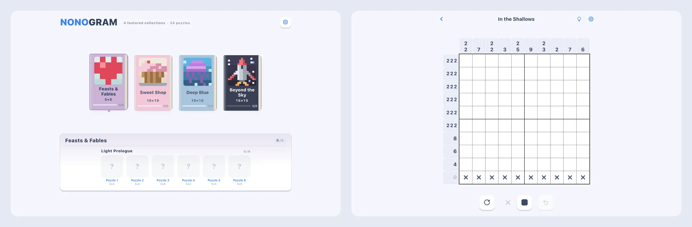

# Gridweave: Nonogram — Web Demo

A public, playable slice of the production app: 24 selected puzzles from 4 collections.

**[Play the demo](https://play.nonogram.com.cn/?lang=en)** · **[How it was built](https://nonogram.com.cn/en/build)** · **[App Store](https://apps.apple.com/app/gridweave-nonogram/id6812812939)**



## Architecture

- React 19 + TypeScript + Vite. The same source ships as the iOS and Android apps; this repository is its web demo build.
- `src/utils/hint.ts` and `lineState.ts`: the hint engine. It reasons one line at a time the way a player would, says which line to look at and why, and never fills a cell for you.
- `src/utils/solver.ts`, `exact-solver.ts` and `validator.ts`: deterministic checks that every puzzle has exactly one solution, can be solved by line logic alone, and is not a rotation or mirror of another.
- `src/hooks/useGameState.ts` and `usePointerInput.ts`: board state, drag strokes, and undo one stroke at a time.
- `src/components/Board/`: the board and the reveal animation.
- `vite/nonogram-library.ts` and `vite/demo-content.ts`: puzzles are bundled at build time through a virtual module and limited to the demo manifest, `src/data/demo.json`.
- `src/i18n/`: nine languages, resolved before the first frame.

## What's included

- The game code as the web demo runs it, taken from the production repository by an export script with a whitelist.
- The 24 puzzles and their scenes, and name catalogs for exactly those puzzles.
- Tests for the solver, validator, hint engine, game state, input, the game screen and the demo content.
- CI: install, typecheck, test, build.

## What's intentionally private

The production mobile apps, full 600-puzzle library, billing, release infrastructure, and unreleased content remain in the private production repository.

Where the shared code imports something the demo never reaches (the daily calendar, account sign-in, the purchase sheet, the update prompt, developer tools), the file here is a short stub that says so. Code comments are mostly in Chinese and sometimes point to private documents.

## Run it

```bash
npm install
npm test
npm run dev
```

`npm run build` produces the same static site that is deployed to play.nonogram.com.cn.

## License

Copyright © Jack / Gridweave. All rights reserved. You may download, clone, build and run this repository for personal evaluation, recruitment review and non-commercial educational inspection. See [LICENSE](LICENSE).
